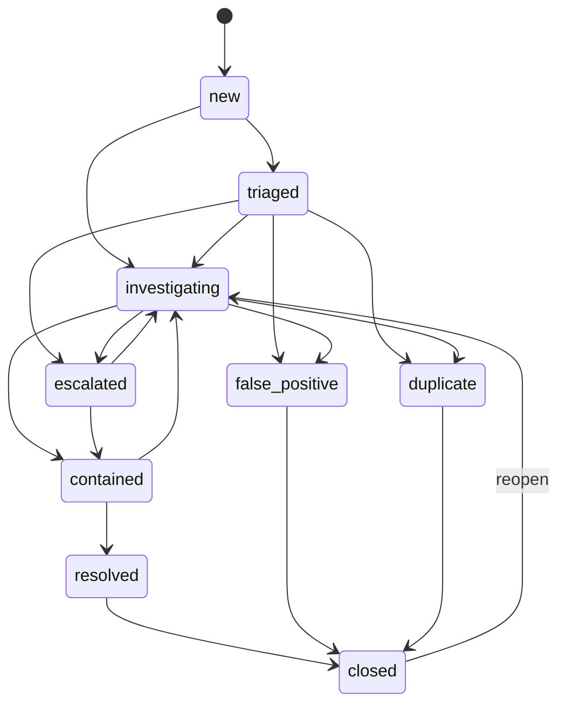

# Case state machine

Allowed **Case.status** values, transitions, roles, and SLA hooks. Aligns with **Case** in [entities.md](./entities.md).

## Status enum (canonical)

`new` → `triaged` → `investigating` → `escalated` → `contained` → `resolved` → `closed`

Terminal or absorbing states: `false_positive`, `duplicate`, `closed` (from multiple paths)

Full set:

| Status | Meaning |
| ------ | ------- |
| `new` | Created; not yet reviewed |
| `triaged` | Initial classification done; in queue |
| `investigating` | Active work |
| `escalated` | Requires senior / external handling |
| `contained` | Harm mitigated per playbook; monitoring may continue |
| `resolved` | Work complete; pending final closure |
| `false_positive` | Determined not to be a real issue |
| `duplicate` | Merged with another case |
| `closed` | Archived; no further action |

---

## Allowed transitions

Use this as the contract for APIs and automations. **Deny** any transition not listed.

| From | To | Typical actor |
| ---- | -- | ------------- |
| `new` | `triaged` | analyst, automation |
| `new` | `investigating` | lead (skip triage when policy allows) |
| `triaged` | `investigating` | analyst |
| `triaged` | `false_positive` | analyst, lead |
| `triaged` | `duplicate` | analyst, lead |
| `triaged` | `escalated` | analyst, lead |
| `investigating` | `escalated` | analyst |
| `investigating` | `contained` | analyst, lead |
| `investigating` | `false_positive` | lead |
| `investigating` | `duplicate` | lead |
| `escalated` | `investigating` | lead |
| `escalated` | `contained` | lead |
| `contained` | `resolved` | lead |
| `contained` | `investigating` | lead (reopen) |
| `resolved` | `closed` | lead, automation (after cooling period) |
| `false_positive` | `closed` | lead, automation |
| `duplicate` | `closed` | lead, automation |
| `closed` | `investigating` | lead only (reopen with **AuditEvent**) |

**Automation** may only move cases along paths explicitly allowed by policy (e.g. auto-`triaged` from enrichment, auto-`closed` after SLA window with no activity).

---

## Alert vs Case

- **Alert.status** is lighter weight (`new` … `closed`); see [entities.md](./entities.md).
- When an alert is **promoted** to a case, case starts at `new` or `triaged` per policy.
- Closing a **case** does not automatically delete alerts; link **linkedAlertIds** and record resolution.

---

## SLA hooks

- **slaDueAt** on Case is derived from **severity**, **regulatory clock**, or **customer SLA** (deployment-specific tables).
- On breach: emit **AuditEvent**, optionally auto-`escalated` or notify assignees.
- Store SLA policy id/version on the case when needed for audit replay.

---

## Diagram (reference)

