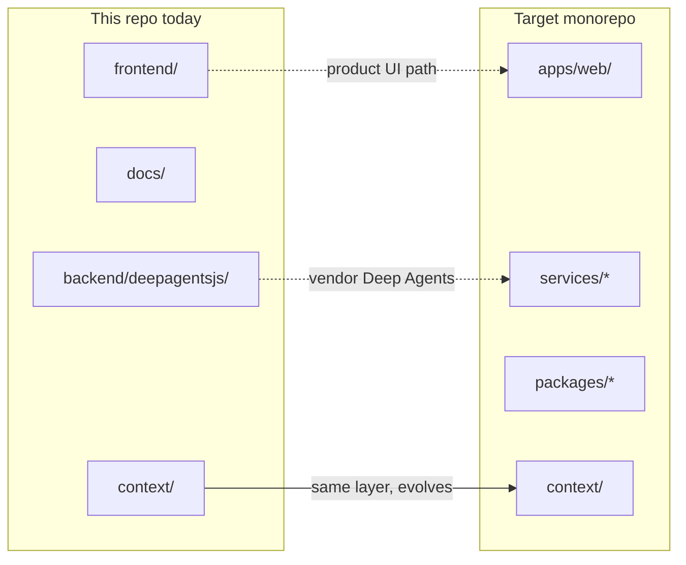
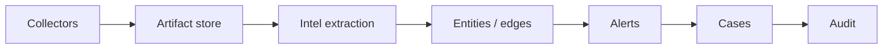
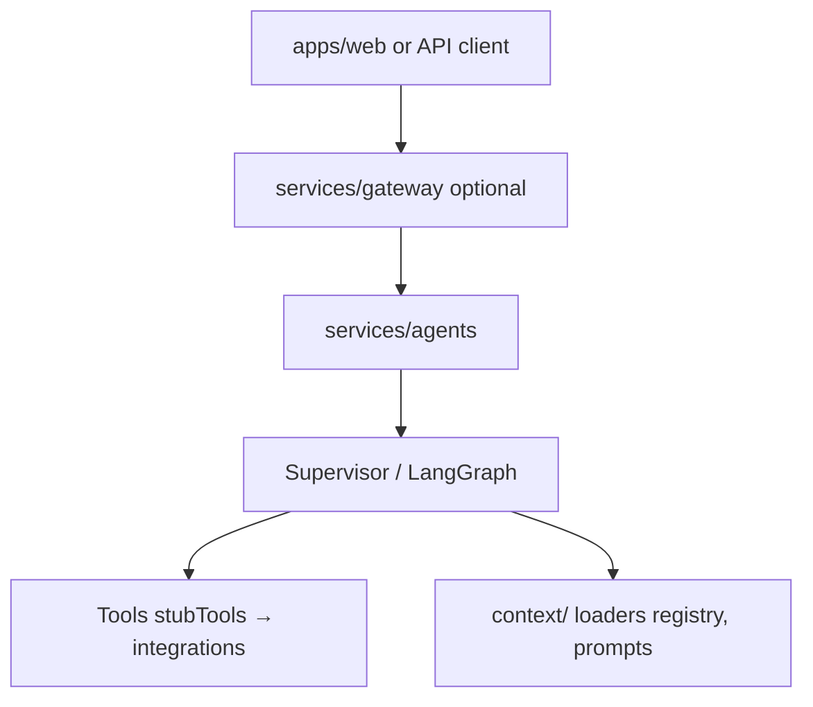
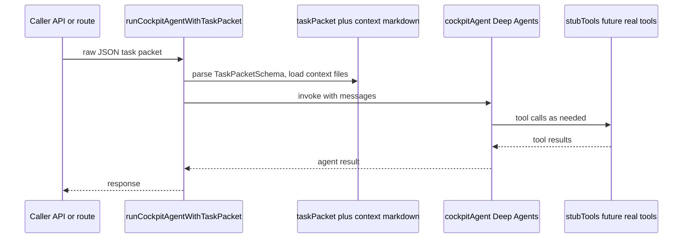
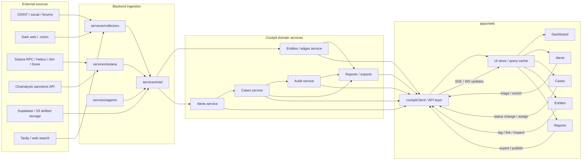
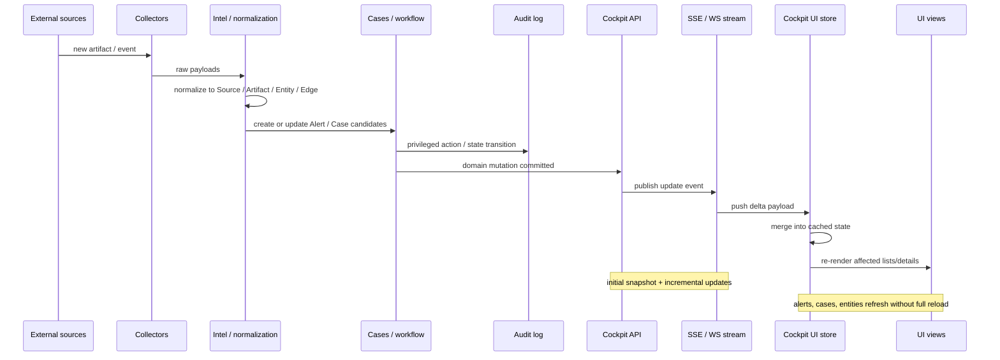
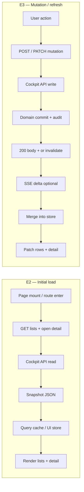
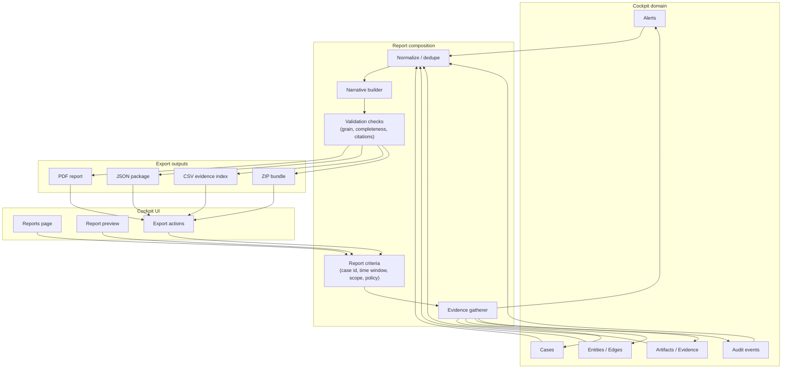
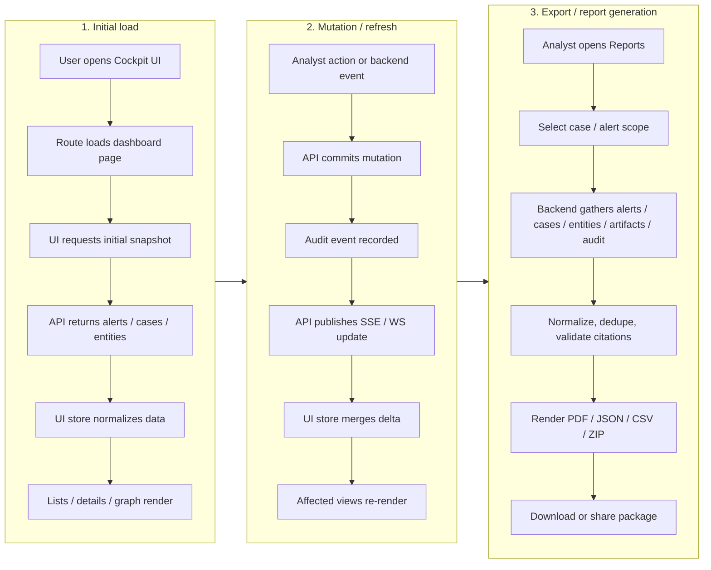

# Architecture overview (diagrams)

Mermaid diagrams for the **target** Cockpit shape and how it relates to **this repository today**. For the full ASCII tree and file-level detail, see [target-repo-layout.md](./target-repo-layout.md). For the planned `services/agents/` package (Deep Agents, context loaders, stub tools), see [services-agents-context-starter.md](./services-agents-context-starter.md).

## When to read which doc

| Need | Document |
| ---- | -------- |
| **Guided paths** (adapter vs agents vs explain) | [docs/README.md](../README.md#reader-paths) |
| **Canonical context pack** (index, load order) | [context/index.md](../../context/index.md) |
| Canonical **folder tree** (future monorepo) | [target-repo-layout.md](./target-repo-layout.md) |
| **Agents** package layout, `taskPacket`, TS snippets | [services-agents-context-starter.md](./services-agents-context-starter.md) |
| **Context engineering** process and repo mapping | [context-engineering-playbook.md](../context-engineering-playbook.md) |
| Short **stub** service table | [context/architecture/monorepo-map.md](../../context/architecture/monorepo-map.md) |
| **Backend → UI** event loop (collectors, domain, API, store) | Section **D** below |
| **Realtime** push path; **initial load vs mutation** (E2/E3) | Section **E** below |
| **Report / export** composition (evidence → bounded package → PDF/JSON/ZIP) | Section **F** below |
| **Three-panel** summary (initial load + mutation + export side by side) | Section **G** below |

**Together:** **§ D** is the static backend→UI data plane; **§ E** is the live update sequence (**§ E2** / **§ E3** pull vs write); **§ F** is the defensible export path. **§ G** shows those **client-facing** flows in one row.

---

## A — Repository today vs target layout

The ASCII tree in `target-repo-layout.md` remains canonical; this diagram summarizes the **mapping** only.

`docs/` stays the home for technical notes in both shapes; `packages/*` has **no** direct counterpart in the tree today (shared types land there in the target layout).

**Notes:** `backend/deepagentsjs/` is **vendored upstream** Deep Agents JS, not the Cockpit-specific `services/agents/` service described in the starter doc. `services/*` and `packages/*` are **not** present as full implementations in this repo yet.

---

## B — Intel and case pipeline (target)

High-level flow from ingestion to audit. Same story as the one-liner in `context/architecture/monorepo-map.md`, expanded as a chain.

---

## C — Agents layer (target)

How the UI/API, agent runtime, tools, and checked-in **context** relate. Stub tools later become Sim / Dune / RPC and other server-side integrations (credentials via env, not in client).

### C1 — Component view

### C2 — Task packet flow (starter pattern)

Mirrors the flow in [services-agents-context-starter.md](./services-agents-context-starter.md): parse `taskPacket`, resolve context keys, invoke `cockpitAgent`.

---

## D — Backend-to-frontend data flow (target)

End-to-end picture: external sources and ingestion services produce normalized **domain** objects; an API layer hydrates the web client; mutations and realtime channels close the loop. Maps loosely to [`context/domain/integrations.md`](../../context/domain/integrations.md), [`context/domain/entities.md`](../../context/domain/entities.md), and [`context/domain/case-state-machine.md`](../../context/domain/case-state-machine.md). In the target layout, `frontend/` evolves into `apps/web/` (see section **A**).

### How to read it

Data starts in external sources, passes through collectors and chain/integration services, then through intelligence extraction and normalization before becoming Cockpit domain objects. Domain services feed the API layer, which hydrates the client store and powers dashboard, alert, case, entity, and report surfaces. Mutations go back through the API; push-style updates refresh the store without a full reload.

### Cockpit-specific meaning

- **Collectors** ingest raw artifacts from OSINT and dark-web-style sources (see integration notes under `docs/`).
- **Intel** normalizes artifacts into **entity**, **edge**, **alert**, and **case** shapes (see `context/domain/entities.md` and the case lifecycle in `context/domain/case-state-machine.md`).
- **Solana services** enrich wallets, programs, and transactions via RPC, indexers, Sim, Dune, etc. (per adapter docs).
- **Agents** assist with routing, extraction, and enrichment but still land in the same domain layer ([`services-agents-context-starter.md`](./services-agents-context-starter.md)).
- **Audit** records privileged actions and important workflow transitions ([`context/domain/rbac-audit.md`](../../context/domain/rbac-audit.md)).

### Example API contract (illustrative)

Not implemented in this repo; sketches the minimum **resource + mutation** surface for the UI:

- `GET /alerts`, `GET /cases`, `GET /entities`, `GET /reports`
- `POST /alerts/:id/triage`, `POST /cases/:id/status`, `POST /entities/:id/link`, `POST /reports/export`

The backend owns normalization, policy, and audit boundaries; the client stays thin.

For a **sequence-level** view of how committed domain changes reach the UI over a push channel, see **§ E**. For **report composition and export packages** (what `POST /reports/export` implies), see **§ F**.

---

## E — Realtime update flow (target)

Mostly **server → client** streaming: REST or query endpoints supply an initial snapshot; **SSE** (or similar) delivers incremental deltas so lists and detail panes refresh without a full page reload. Complements the static flowchart in **§ D** (`API -->|SSE / WS updates| STORE`).

The **sequence diagram below** is the **push path** after backend work commits. **§ E2** and **§ E3** sit **beside** each other: **pull snapshot** on first paint vs **write + merge** (response and/or stream) after user actions.

### E2 / E3 — Initial load vs mutation / refresh (paired)

Read **left → right**: cold **snapshot** load (typical **GET** + cache) vs **mutation** and how the **store** updates (HTTP **response**, optional **query invalidation**, optional **SSE** delta from **§ E** sequence above).

**E2:** No domain write—only **reads** materialize the first consistent view (pagination and filters apply on the query string or body as designed).

**E3:** The **write** path returns enough for optimistic UI or triggers **refetch**; **SSE** (when connected) carries the same logical change for other clients or tabs. Prefer **merging** the smallest patch into the store instead of reloading the whole page.

### How it works

Ingestion and normalization happen before anything user-visible. After **cases** (and related workflow) commit through the **API**, the server publishes an event on the **stream**; the client **store** merges the delta and drives targeted **re-renders**. Initial page load still typically uses REST or GraphQL-style reads; the push channel handles ongoing change (common dashboard pattern).

### Cockpit-specific meaning

- **Collectors** and **intel** match the same ingestion story as **§ D** ([`context/domain/integrations.md`](../../context/domain/integrations.md), [`context/domain/entities.md`](../../context/domain/entities.md)).
- **Cases** and **audit** reflect workflow and privileged actions ([`context/domain/case-state-machine.md`](../../context/domain/case-state-machine.md), [`context/domain/rbac-audit.md`](../../context/domain/rbac-audit.md)).
- **UI** updates should stay **incremental** (list rows, open detail panes) to avoid refetching entire tables on every event.

### Implementation split (recommended)

| Layer | Role |
| ----- | ---- |
| REST / queries | Initial load, pagination, mutations |
| **SSE** | Default for **server → client** dashboards and notification-style feeds |
| **WebSockets** | Reserve for **bidirectional** or collaboration-heavy features later |

Not implemented in this repository’s static `frontend/` shell; target for when a Cockpit API and realtime gateway exist.

---

## F — Report / export flow (target)

How **alerts**, **cases**, **entities**, **artifacts**, and **audit** records compose into a **bounded, defensible package** (human-readable or machine-readable) for analysts, reviewers, or downstream tools. Aligns with [`context/domain/entities.md`](../../context/domain/entities.md), [`context/domain/case-state-machine.md`](../../context/domain/case-state-machine.md), and [`context/domain/rbac-audit.md`](../../context/domain/rbac-audit.md).

### How it works

Scope is explicit first (**criteria**): case, time window, investigation question, or policy. The **gatherer** pulls the relevant domain objects, **normalizes / dedupes** them into one consistent shape, then a **narrative** layer (templates + citations) feeds **validation checks** before any file is emitted. Outputs are parallel artifacts (PDF, JSON, CSV index, ZIP bundle) handed back to **export actions** in the UI.

### Cockpit-specific interpretation

- **Alerts** — investigative findings that may appear scoped to the export.
- **Cases** — usually define the boundary and narrative spine ([`context/domain/case-state-machine.md`](../../context/domain/case-state-machine.md)).
- **Entities / edges** — graph evidence and relationship story ([`context/domain/entities.md`](../../context/domain/entities.md)).
- **Artifacts** — source material anchoring claims ([`context/domain/entities.md`](../../context/domain/entities.md)).
- **Audit events** — who changed what and when ([`context/domain/rbac-audit.md`](../../context/domain/rbac-audit.md)); often summarized or included as a defensibility appendix.

Scoring context ([`context/domain/scoring-rubric.md`](../../context/domain/scoring-rubric.md)) can inform narrative and checks when reports include risk explanations.

### Recommended export checks

Before releasing a package:

- **Grain** is explicit (what one row / one citation means).
- **Evidence window** is bounded (time range, case scope).
- **Completeness** — required objects for the chosen report type are present or explicitly marked absent.
- **Citations** resolve to retrievable records (IDs, hashes, or stable links).
- **Redaction** — sensitive fields removed per policy.

### Suggested export products

| Output | Typical use |
| ------ | ----------- |
| **PDF** | Human review, briefings |
| **JSON** | APIs, automation, structured handoff |
| **CSV evidence index** | Analysts, auditors, spreadsheet workflows |
| **ZIP bundle** | Full pack including attachments and manifests |

Not implemented in this repository’s placeholder `Reports` route; target for when a report service and storage for manifests exist.

---

## G — Three-panel view: initial load, mutation / refresh, export (summary)

Three **operational modes** on one **Cockpit** system: **hydration**, **live update**, and **defensible export**. Each subgraph is a linear story; **Panel1 → Panel2 → Panel3** reads as a typical analyst session (open → work → export), not a hard pipeline dependency—the modes can run in any order in production. Detail: **§ E2** / **§ E3**, **§ E** (SSE sequence), **§ F** (full export graph).

### How to read it

- **Panel 1 — Hydration:** user opens Cockpit, the route loads, and the UI pulls an **initial snapshot** for alerts, cases, and entities into a normalized store, then renders lists, details, and graph views.
- **Panel 2 — Live update:** a **mutation** or **backend-committed** change is **audited**, **published** on SSE/WebSocket, **merged** into the client store, and only **affected** views re-render (**§ E**).
- **Panel 3 — Export:** analyst scopes a **case / alert** window; the backend **gathers** domain objects and **audit**, **validates** grain and citations, **renders** artifacts, then **download or share** (**§ F**).

| Panel | Role |
| ----- | ---- |
| **1** | Cold **snapshot** (pull); no domain write—fills the store for first paint. |
| **2** | **Command + push refresh**; triage, case status, entity linking stay in sync without full page reload. |
| **3** | **Bounded export**; same underlying data as operations, packaged for review or handoff. |

### Cockpit meaning

- **Initial load** hydrates operational surfaces with current alerts, cases, and entities ([`context/domain/entities.md`](../../context/domain/entities.md), [`context/domain/case-state-machine.md`](../../context/domain/case-state-machine.md)).
- **Mutation / refresh** keeps triage and workflow consistent with **audit** expectations ([`context/domain/rbac-audit.md`](../../context/domain/rbac-audit.md)).
- **Export / report generation** produces an **audit-ready** bundle from the same canonical domain objects ([`context/domain/integrations.md`](../../context/domain/integrations.md) for adapter boundaries).

### Recommended implementation shape

- **REST** or **query** endpoints for the **initial snapshot** and for **pagination** / filters.
- **SSE** (or WS where needed) for **incremental** updates after commits (**§ E**).
- A dedicated **report composition** path (e.g. `POST /reports/export` or async job + poll) for **exports**, separate from the live dashboard read model—same domain types, different **bounded** slice and validation (**§ F**).

All three modes share the **Cockpit API** boundary (**§ D**). Not implemented end-to-end in this repository’s static `frontend/` shell.
